## <b>Rasp NAS</b>

J'ai réalisé cette application en 4 jours pour mon école lors d'une semaine sur des projets libres.

Cette application est réalisée en JavaScript/React côté front et en Python/Flask côté back. Elle utilise aussi une base de données MySQL.

<div align="center">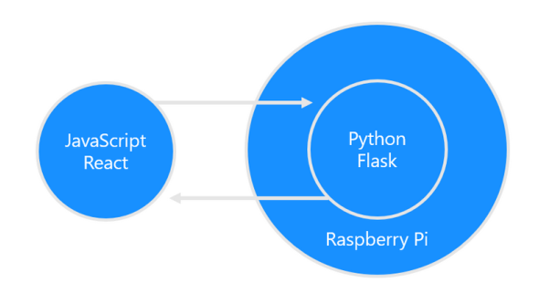</div>

J'ai choisi de faire un NAS modulaire en utilisant une Raspberry qui héberge le logiciel et qui permet le contrôle et l’accès aux disques.
L'application gère le contenu des espaces de stockage qui sont connectés au Raspberry peu importe leur forme (clé USB, disque dur, ...). 

Il est possible via l'interface web accessible par tous les PC du réseau local de :
* Consulter la répartition des espaces de stockages
* Visualiser le contenu des espaces de stockages
* Télécharger des fichiers
* Uploader des fichiers
* Lire des fichiers vidéo/audio
* Créer des dossiers sur les disques
* Rechercher des fichiers
* S'inscrire/Se connecter (l'app n'accepte qu'un seul utilisateur)

Pour ajouter des disques accessibles par l'application il suffit de rajouter le chemin dans le fichier config.json.
```
{
    "api" : "http://192.168.43.192:5000/",
    "path":[
        "C:\\,
        "D:\\"
    ]
}
```

Vous pouvez installer l’application sur votre pc ou sur une raspberry. Par la suite l’application sera accessible par tous les PC connectés à votre réseau wifi. Pour cela, il faudra ouvrir un navigateur et taper dans la barre d’adresse :  ipdupcquihostlappli:3000

## 👁️ <b>Aperçu</b>

<p align="center">Vue de connexion</p>
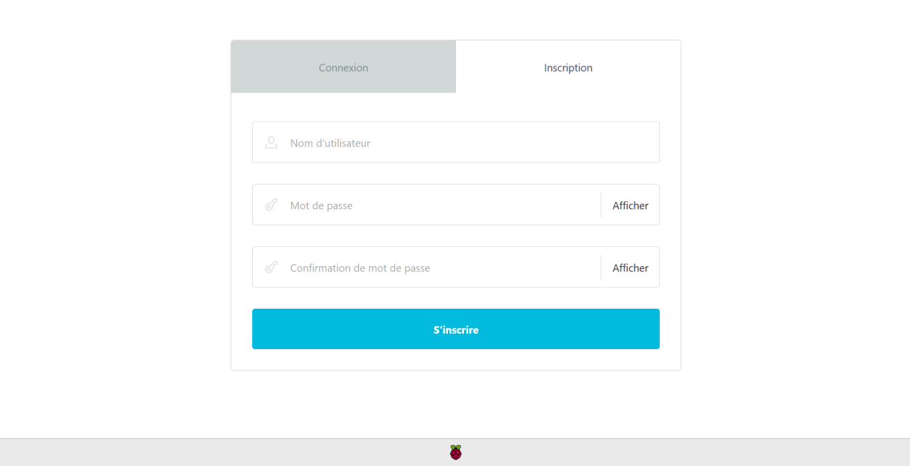
<p align="center">Vue d'inscription</p>
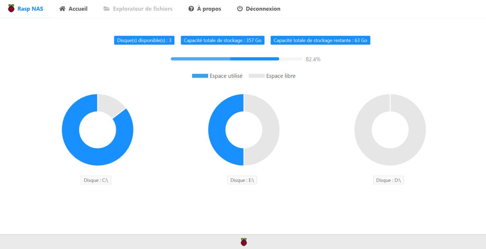
<p align="center">Page d'accueil</p>
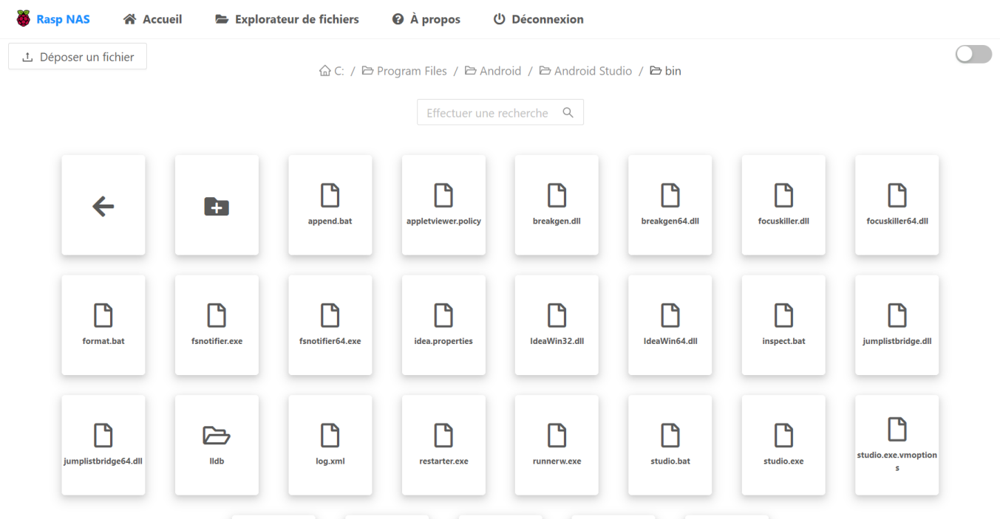
<p align="center">Exemple d'arborescence</p>
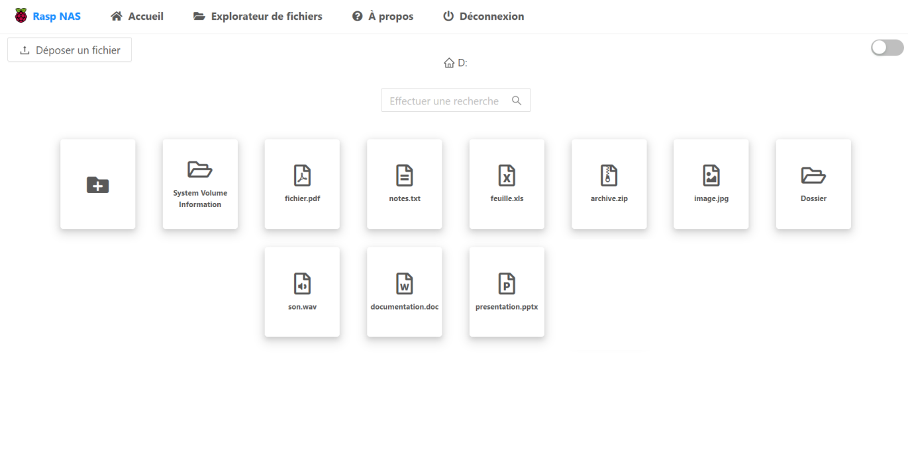
<p align="center">Assets d'icones</p>
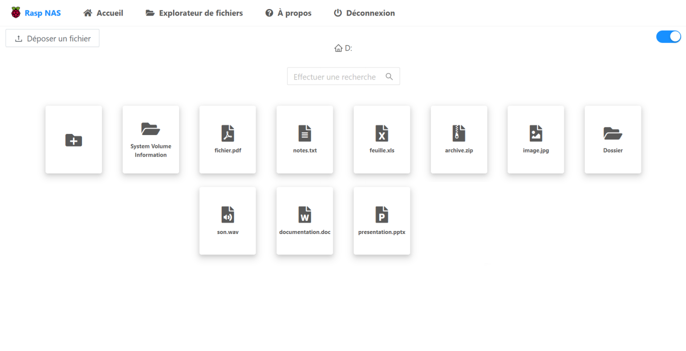
<p align="center">Thème d'icone sombre</p>
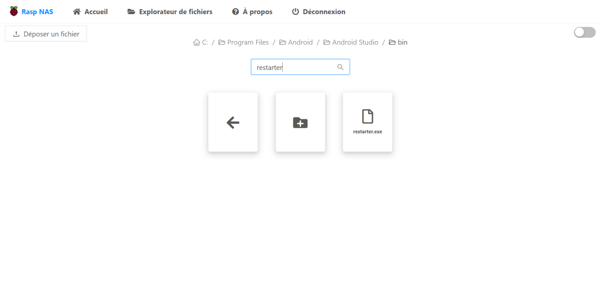
<p align="center">Recherche par filtre</p>
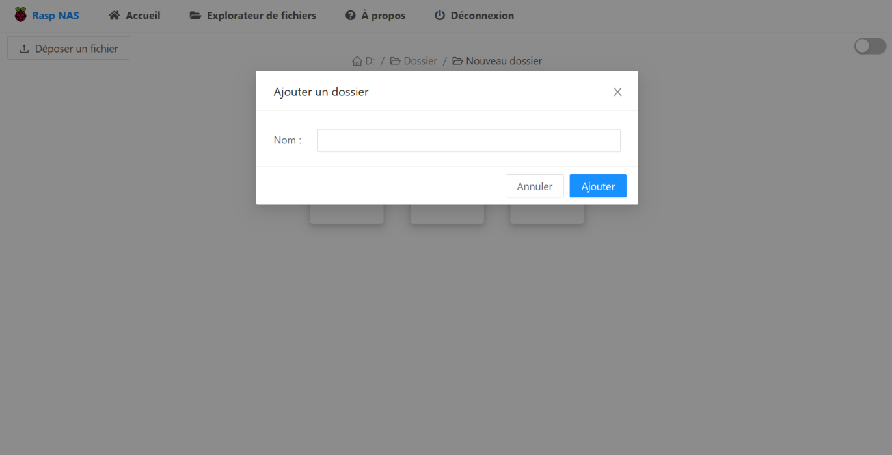
<p align="center">Création de dossier</p>
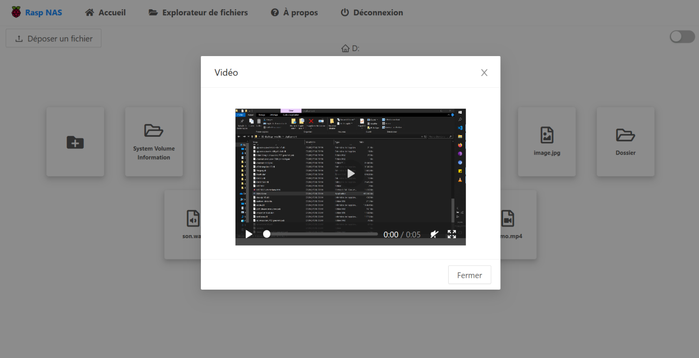
<p align="center">Visualisation de vidéo</p>
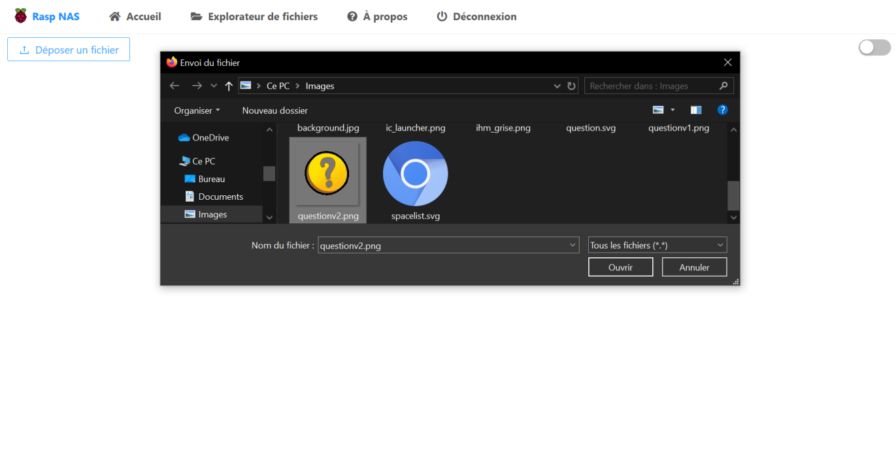
<p align="center">Upload de fichier</p>
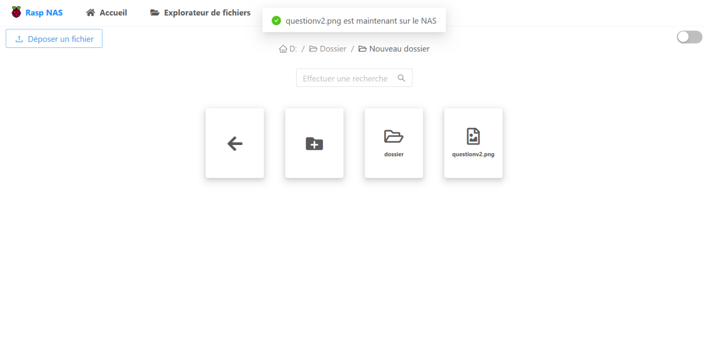
<p align="center">Fichier uploadé sur le NAS</p>
    
## 📦 <b>Installation</b>
### <b>1. Préalable pour le fonctionnement</b>
(Pour une installation sur raspberry je ne fournis pas la documentation permettant de rendre le localhost accessible par tous les PC du réseau ni le partage des disques. Pour un setup simple, prendre un pc windows et faire les instructions ci-dessous)

1.  Installer git 
2.	Installer node.js
3.	Ouvrir un terminal et taper `npm install yarn`
4.	Puis saisir `git clone https://github.com/BarnaGH/RaspNAS` à l’endroit où vous souhaitez l’installer (peu importe l’endroit)
5.	Installer python dans une version supérieur à la 3.3
6.	Installer un logiciel de type WAMP
7.	Créer une base de données nommée « raspnas »
8.	Injecter le fichier sql « user.sql » situé à la racine du dépôt git
9.	Ouvrir le fichier « config.json » situé sous src/config.json
10.	 Ajouter les chemins des disques que vous souhaitez utilisés
11.	 Changer la ligne api et mettre l’ip de la machine qui va lancé l’api dans config.json
12.	 Dans le fichier api.py, changer la ligne 12 et ajouter le chemin vers votre fichier de configuration  
13.	 Pour finir, à la fin du fichier api.py, changer les informations de connexion à votre base si besoin.
  
### <b>2. Front End</b>
Pour faire fonctionner l’application côté front : 
1.	Se rendre à la racine du dossier cloné via le terminal
2.	Saisir `yarn` dans le terminal pour installer les paquets
3.	Une fois l'installation des node_modules terminés, saisir `yarn startf`
4.	Une fois le serveur lancé, le navigateur va s’ouvrir vers l’adresse localhost:3000

### <b>3. Back end</b>
Pour faire fonctionner l’application côté back :
1.	Se rendre dans le dossier apiFlask du dépôt git
2.	Ouvrir un terminal différent du premier dans le dossier apiFlask et taper `python api.py`
3.	S’il manque des paquets sur votre machine comme python3-flask-cors ou python3-mysql.connector, installer les paquets avec la commande `pip install`
4.	Puis relancer l’api 
5.	Se rendre sur localhost:3000 et tester l’application

## 📄 <b>Licence</b>

This project is licensed under the MIT License - see the [LICENSE.md](LICENSE.md) file for details